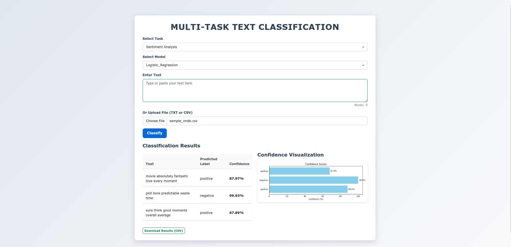

## text_classification_app

## Setup
1. **Install dependencies**:
   Create a virtual environment and upgrade the version of ```pip```
   ```bash
   python3 -m venv .env
   source .env/bin/activate
   python -m pip install -U pip
   ```
   Install the required packages
   ```bash
   cd text_classification_app
   pip install -r requirements.txt
   ```

2. **Run the application**:
   ```bash
   python app.py
   ```
   The server is setup on port 5000.

## How It Works
1. Users input text or upload CSV files containing texts via the web interface.
2. The app processes the text with multiple pretrained models (ML, LSTM, Transformer) for tasks such as sentiment analysis, spam detection, and topic classification.
3. Predicted labels and confidence scores are displayed for each input text, with options to export results.

## Code Structure
- `app.py`: Main Flask application, handles routes, user input, and prediction.
- `models/checkpoints`: Contains pretrained ML and LSTM model files and source code.
- `utils`: Utility functions for preprocessing, loading embeddings, and vocabularies.
- `data`: Contains vocabulary files and GloVe embeddings.
- `templates/index.html`: Stores uploaded and processed images.
- `static/css/`: CSS files for styling the web pages.

## Notes
- The app supports multiple text classification tasks with different models for comparison.
- Large model files are stored externally (e.g., Google Drive) and loaded at runtime.
- For better performance, a CUDA-enabled GPU is recommended if using LSTM models.
- The app can be deployed on Render or similar cloud services for public access.

## Acknowledgments
- Built using [PyTorch](https://pytorch.org/) and [Hugging Face](https://huggingface.co/docs/transformers/index) Transformers.
- Pretrained models and datasets sourced from public repositories.
- Inspired by the need for a simple, multifunctional text classification web application.
